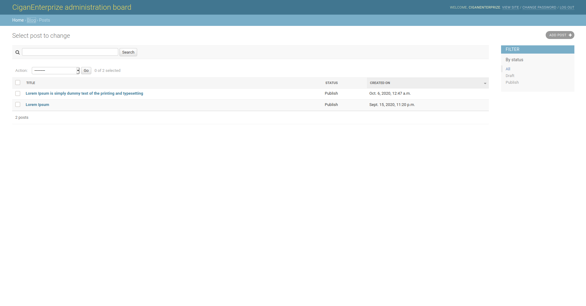
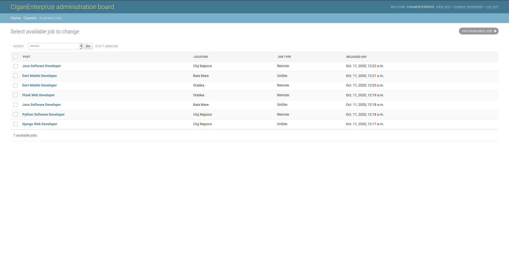
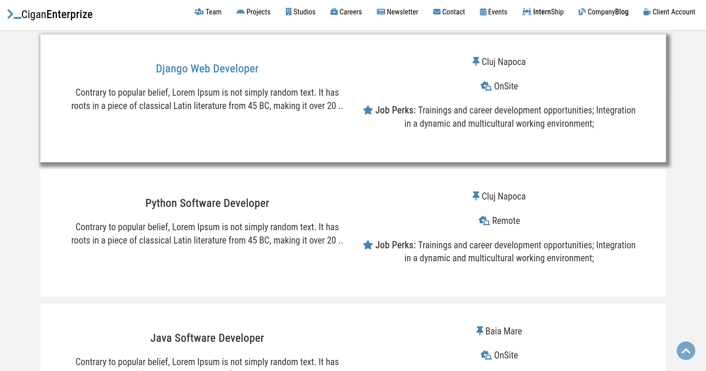

# CiganEnterprize

This webapp represents the concept of a business focused on digital solutions with lots of functionalities
and subsystems who are very well automated.

 
 ## Backend

In the backend I have 9 databases each of them being strong related to a subsystem automated in the webapp.
I have also integrated the CRM plugin ( more details here -> ... ) for managing the clients and the projects
the company is working at. Excluding the databases included by the CRM, there are 5 databases.
* BLOG which includes only one table: Posts
* MAINCOMPONENT which includes three tables: Employers, Projects, Studios.
* EVENTS which includes three tables: Host events, Past Events, Sponsor Events
* COMMUNICATION which includes two tables: Contact and Newsletter
* CAREERS which includes four tables: AvailableInternships, AvailableJobs, InternshipsAppliance, JobsAppliance 

A part of the databases can be seen below. 

##### BLOG

The Posts table from the Blog Database includes all the articles which can be seen in the platform
at the company blog section. From this part of the administration system you can actualise, 
change or write articles very easy through a basic form.

##### Checking the articles from the blog system

##### Adding a new article

##### The way it looks in the UI

Also for making the user job simpler I also implemented a search engine through the articles.

This blog system was also implemented in ciganoliviudavid webapp which is my personal website ( Details here -> ...).

##### CAREERS

In this database I practically store open jobs and internships in the company as well as appliances for 
those jobs. The administrator is able to add open jobs and check out the appliances for all open jobs
in the company. Because the use case of the webapp was about a company which had different locations in 
the country I had to create open jobs for specific locations. I also wanted to have the same open job 
in different locations. This was a little bit problematic at first sight but it was solvable just by
implementing some logic between the tables Studios and AvailableJobs, AvailableInternships. It's about
a foreignKey relationship.

The AvailableJobs and AvailableInternships tables are pretty much the same thing with just some fields
as difference.

##### This is how listed jobs look like in the administration panel

##### This is how the form looks when adding a new open job

##### This is how the UI with open jobs looks like

##### As a user you can see more details about the job by clicking on it

The system will automatically create a page for every job that was added in the administration panel, 
in one way or another this system is similar with the one implemented in the blog.

The InternshipAppliance table is pretty similar with the JobsAppliance, the differences are just
some special fields every table has but the system behind them is the same. The ideea is that you can
apply for the job through a simple form in the webapp.
